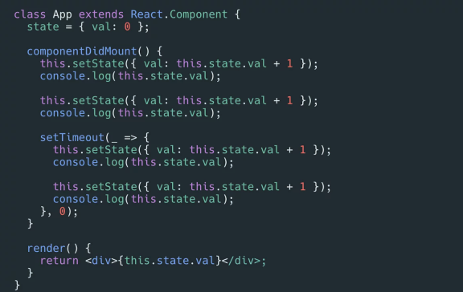

**会根据阅读的进度持续更新这个文件，会存在一些错误，希望加着自己的理解来看**

react是一个庞大的框架，包含了太多太多概念。如本人水平有限，如果直接抠细节很容易把自己绕昏，这里持续更新一些概念解释，帮助自己记录，也能对react中包含的信息有个总体的概念

## 复杂？

react是很复杂，但是也不能一口全吞式的吃进去

他的思想是明确的分成了几个步骤，在步骤中处理各自的事情。比如 init阶段一般就是创造fiber、update等对象，schedule阶段就是判断节点更新的优先级，commit阶段就是提交更新，render阶段再进行html操作。并不是一条线式的更新，而可以分成一个部分一个部分的理清楚

## Fiber

*Fiber只是一个对象，其中的属性记录了很多信息，这些信息在不同的阶段对应不同的处理方法*，不要把它想的太神秘
这里放个图，可以看个大概

## setState -- 同步？异步？

执行方法是同步！是同步！是同步！
只是react为了优化更新，分了不同的update机制，比如`batchedUpdate`是批量更新，就会造成setState“异步”的感觉
这里附一张图，理解了这里，基本就可以理解setState的机制
