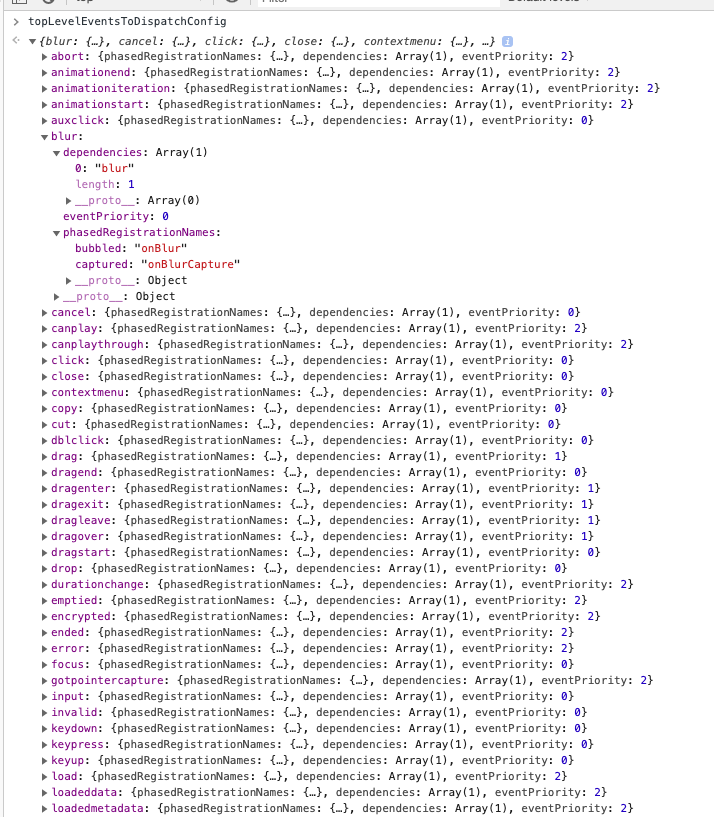

上一节从completeWork开始，看到了注入属性和注入事件的开始，这一节主要是深入到注入属性的内容去


把setInitialProperties去掉多余的代码，只抓一个点来看，以熟悉的`<input>`来看

[掘金-react事件机制总结](https://juejin.im/post/5d44e3745188255d5861d654)

```js
// react-dom/src/client/ReactDOMComponent.js
export function setInitialProperties(
  domElement: Element,
  tag: string,
  rawProps: Object,
  rootContainerElement: Element | Document,
): void {
  // 根据tag标签判断是不是自定义组价标签，比如包括 '-' 的组件等等
  const isCustomComponentTag = isCustomComponent(tag, rawProps);

  // TODO: Make sure that we check isMounted before firing any of these events.
  let props: Object;
  // 所有下面的标签（主要是媒体组件），不能通过事件代理绑定到root上，所以自己绑定到domElement
  // 而普通的element，直接走到下面setInitialDOMroperties，传入了rootContainerElement，把事件统一绑定到root上-document
  switch (tag) {
    case 'input':
      // 这个函数主要是针对input的初始化value以及checked属性
      ReactDOMInputInitWrapperState(domElement, rawProps);
      // 和受控非受控有关，见下面函数分析及注释
      props = ReactDOMInputGetHostProps(domElement, rawProps);
      // TOP_INVALID 这里理解成 'invalid'
      // trapBubbledEvent(type, dom) => trapEventForPluginEventSystem(dom, type, false)
      trapBubbledEvent(TOP_INVALID, domElement);
      // For controlled components we always need to ensure we're listening
      // to onChange. Even if there is no listener.
      ensureListeningTo(rootContainerElement, 'onChange');
      break;
    default:
      props = rawProps;
  }

  setInitialDOMProperties(
    tag,
    domElement,
    rootContainerElement,
    props,
    isCustomComponentTag,
  );

  switch (tag) {
    case 'input':
      // TODO: Make sure we check if this is still unmounted or do any clean
      // up necessary since we never stop tracking anymore.
      track((domElement: any));
      ReactDOMInputPostMountWrapper(domElement, rawProps, false);
      break;
    default:
      if (typeof props.onClick === 'function') {
        // TODO: This cast may not be sound for SVG, MathML or custom elements.
        trapClickOnNonInteractiveElement(((domElement: any): HTMLElement));
      }
      break;
  }
}
```


-------------

* 注入属性

`ReactDOMInputInitWrapperState`  主要是根据 input的类型
这里由于更新视图要重新渲染input组件，所以要记录input中的内容，如果是checkbox，那要记录上次的checked与否
同时，由于react分了受控和非受控组件，这里能通过`isControlled`函数判断其实就是通过组件中有没有传`checked`或者`value`属性来判断

```js
// react-dom/src/client/ReactDOMInput.js
export function initWrapperState(element: Element, props: Object) {
  const node = ((element: any): InputWithWrapperState);
  const defaultValue = props.defaultValue == null ? '' : props.defaultValue;

  node._wrapperState = {
    initialChecked:
      props.checked != null ? props.checked : props.defaultChecked,
    initialValue: getToStringValue(
      props.value != null ? props.value : defaultValue,
    ),
    controlled: isControlled(props),
  };
}

function isControlled(props) {
  const usesChecked = props.type === 'checkbox' || props.type === 'radio';
  return usesChecked ? props.checked != null : props.value != null;
}


/**
 * Implements an <input> host component that allows setting these optional
 * props: `checked`, `value`, `defaultChecked`, and `defaultValue`.
 *
 * If `checked` or `value` are not supplied (or null/undefined), user actions
 * that affect the checked state or value will trigger updates to the element.
 *
 * If they are supplied (and not null/undefined), the rendered element will not
 * trigger updates to the element. Instead, the props must change in order for
 * the rendered element to be updated.
 *
 * The rendered element will be initialized as unchecked (or `defaultChecked`)
 * with an empty value (or `defaultValue`).
 */
// ReactDOMInputGetHostProps
// 这个方法就是拿来确定
// 如果是非受控组件，input会随着用户操作而变化
// 而如果是受控组件，就必须要用户手动去修改props才能出发render
function getHostProps(element: Element, props: Object) {
  const node = ((element: any): InputWithWrapperState);
  const checked = props.checked;

  const hostProps = Object.assign({}, props, {
    defaultChecked: undefined,
    defaultValue: undefined,
    value: undefined,
    checked: checked != null ? checked : node._wrapperState.initialChecked,
  });

  return hostProps;
}
```


------------

* 注入事件

react事件权重分为了三种类型 DiscreteEvent,UserBlockingEvent,ContinuousEvent, 分别是0,1,2
通过最下面的图，我们可以看到包括用户操作需要反映的`click` `blur`等类型的事件权重是0，而`drag`相关，鼠标移动相关，等等权重为1，剩下的比如`anication`，媒体组件的事件等等权重为2

descrete - 离散 表示用户的操作网网是不连续的
userblock - 用户阻塞 表示用户的操作会阻塞到一些东西，比如要拖动某东西的时候肯定是阻塞了
continuous - 继续型事件  表示被之前的打断或是什么中断了

也就是说这里就确定了在事件触发以后，更新组件时的update权重。和之前的知识点就联系起来了


```js
function trapEventForPluginEventSystem(
  element: Document | Element | Node,
  topLevelType: DOMTopLevelEventType,   // invalid
  capture: boolean,
): void {
  let listener;
  // 根据事件类型返回权重类型
  // 下面的三个函数形状都差不多，也就是需要看看dispatchDiscreteEvent这几个不同的函数是什么
  // 最后返回listener
  switch (getEventPriority(topLevelType)) {
    case DiscreteEvent:
      listener = dispatchDiscreteEvent.bind(
        null,
        topLevelType,
        PLUGIN_EVENT_SYSTEM,
      );
      break;
    case UserBlockingEvent:
      listener = dispatchUserBlockingUpdate.bind(
        null,
        topLevelType,
        PLUGIN_EVENT_SYSTEM,
      );
      break;
    case ContinuousEvent:
    default:
      listener = dispatchEvent.bind(null, topLevelType, PLUGIN_EVENT_SYSTEM);
      break;
  }
  // 根据上面的获取的listener注册事件权重，注册进去
  const rawEventName = getRawEventName(topLevelType);
  // 注册事件
  if (capture) {
    addEventCaptureListener(element, rawEventName, listener);
  } else {
    addEventBubbleListener(element, rawEventName, listener);
  }
}
```

一直到这里，整个事件注入的过程就结束了。最后通过`addEventCaptureListerner`或者`addEventBubbleListener`把事件绑定到`element`上。
对于可以冒泡的事件来说，element都指代的document元素，这一方面是方便统一管理，另一方面是在dom不停更新的情况下，不需要另外绑定事件，可以节约一定的性能。而这里的listener，是几个事件分发的函数`dispatchEvent`等等，我们在之后详细讲事件分发的机制


```js
// react-dom/src/events/ReactDOMEventListener.js
const {getEventPriority} = SimpleEventPlugin;

// react-dom/src/events/SimpleEventPlugin.js
// getEventPriority是从这里拿到的
// 这里的这个类型推断是一个交叉类型的推断，指SimpleEventPlugin同时具备后面两个对象的特性
const SimpleEventPlugin: PluginModule<MouseEvent> & {
  getEventPriority: (topLevelType: TopLevelType) => EventPriority,
} = {
  getEventPriority(topLevelType: TopLevelType): EventPriority {
    // topLevelEventsToDispatchConfig 其实是一个把所有原生事件按权重分类的一个对象 见最下方图
    
    const config = topLevelEventsToDispatchConfig[topLevelType];
    return config !== undefined ? config.eventPriority : ContinuousEvent;
  },
}


```

topLevelEventsToDispatchConfig 
在程序初始阶段，会把所有的SimpleEvent按权重类型分类，然后统一注入到`topLevelEventsToDispatchConfig`里
之后在事件分发的过程中，就会知道应该分发哪个事件



