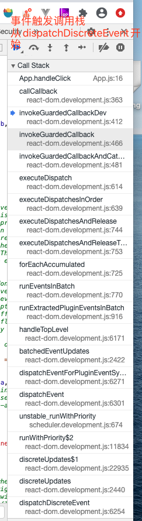
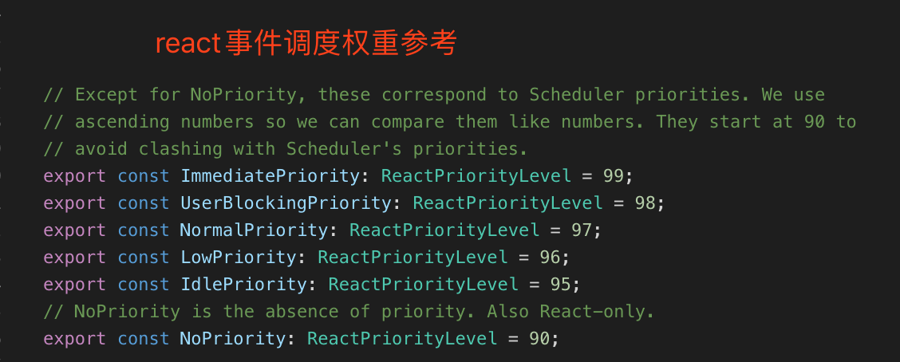

## 

先看一下事件分发的调用栈


最上面的`App.handleClick`就是我们写在函数里的函数内容，而最开始的`dispatchDiscreteEvent`就是在事件注入（绑定）时，绑定到document上的函数，由于绑定的是`onClick`事件，所以触发的是离散型事件

由于前面我们知道react分成三种类型的事件`Discrete`,`UserBlocking`,`Continuous`。分别对应下面三种分发函数
`dispatchDiscreteEvent`, `dispatchUserBlockingUpdate`,`dispatchEvent`

```js
// react-dom/src/events/ReactDOMEventListener.js

function dispatchDiscreteEvent(topLevelType, eventSystemFlags, nativeEvent) {
  // 根据nativeEvent上的时间戳，判断是否需要立即执行update
  // 如果需要就走进ReactWorkLoop,调用权重最大的runWithPriority(ImmediatePriority)立即执行
  flushDiscreteUpdatesIfNeeded(nativeEvent.timeStamp);
  // 走到workLoop里，调用runWithPriority()进入调度
  // 和下面的despatchUserBlockingUpdate几乎一样的函数
  // 因为在react UserBlockingPriority的事件权重是仅次于需要立即执行的事件权重
  // 也就是第二高的 ，所以相当于在分发Discrete和UserBlocking事件类型的时候权重优先级都已经非常高了
  discreteUpdates(dispatchEvent, topLevelType, eventSystemFlags, nativeEvent);
}

function dispatchUserBlockingUpdate(
  topLevelType,
  eventSystemFlags,
  nativeEvent,
) {
  // enableUserBlockingEvents的flag在v16.13.1里已经被移除了
  // https://github.com/facebook/react/commit/9d637844e9761a29a49bc53a9b41244d683f89e3
  // 这里相当于直接按照UserBlockingPriority执行权重
  if (enableUserBlockingEvents) {
    runWithPriority(
      UserBlockingPriority,
      dispatchEvent.bind(null, topLevelType, eventSystemFlags, nativeEvent),
    );
  } else {
    dispatchEvent(topLevelType, eventSystemFlags, nativeEvent);
  }
}

// 现在我们姑且不考虑runWithPriority是怎么按照权重调度的，最终他也会执行第二个fn参数
// 所以我们先直接看它的执行流程
export function dispatchEvent(
  topLevelType: DOMTopLevelEventType,
  eventSystemFlags: EventSystemFlags,
  nativeEvent: AnyNativeEvent,
): void {
  if (!_enabled) {
    return;
  }
  // 通过nativeEvent.target找到对应的target 默认为window
  const nativeEventTarget = getEventTarget(nativeEvent);
  // 通过node.internalInstanceKey 找到对应的instance
  // internalInstanceKey这个变量是在reactDOMHostConfig.js里面
  // createInstance里面注入的属性
  // 也是通过遍历node.parentNode
  let targetInst = getClosestInstanceFromNode(nativeEventTarget);

  if (
    targetInst !== null &&
    typeof targetInst.tag === 'number' &&
    !isFiberMounted(targetInst)
  ) {
    // If we get an event (ex: img onload) before committing that
    // component's mount, ignore it for now (that is, treat it as if it was an
    // event on a non-React tree). We might also consider queueing events and
    // dispatching them after the mount.
    targetInst = null;
  }

  // 这里有enableFlareAPI的开关，但是还没找到这里的作用，先把它放一边，按照默认false的来处理
  // 相当于通过nativeEvent找到了targetInst实例
  // 最终调用的就是despatchEventForPluginEventSystem
  dispatchEventForPluginEventSystem(
    topLevelType,
    eventSystemFlags,
    nativeEvent,
    targetInst,
  );
}

```

react事件类型权重分配



```js
// react-dom/src/evnets/ReactDOMEventListener.js

function dispatchEventForPluginEventSystem(
  topLevelType: DOMTopLevelEventType,
  eventSystemFlags: EventSystemFlags,
  nativeEvent: AnyNativeEvent,
  targetInst: null | Fiber,
): void {
  // 返回了多一个ancestors=[]的对象，其他属性一样
  // 这里有一个记账簿的对象池
  // 是一个有最大长度限制的数组，每次从里面取，用完再把空的push进去
  // 这样节省创建对象和删除的性能
  const bookKeeping = getTopLevelCallbackBookKeeping(
    topLevelType,
    nativeEvent,
    targetInst,
  );

  try {
    // Event queue being processed in the same cycle allows
    // `preventDefault`.
    // 这里就是进入到ReactFiberWorkLoop循环里了
    // 粗略的讲会把执行上下文executionContext改成BatchedContext
    // 然后执行handleTopLevel
    batchedEventUpdates(handleTopLevel, bookKeeping);
  } finally {
    // 释放对象池，和之前有个地方一样
    // react会采用[]来保存N个对象，每次从里面去了用完以后再放回去
    // 为的是减少创建对象和回收对象的性能
    // 对应上面的getTopLevelCallbackBookKeeping
    releaseTopLevelCallbackBookKeeping(bookKeeping);
  }
}
```


这里最后是走到了`batchedEventUpdates`方法里，看到这就感觉会和这个reactDOM.render中的某些函数（`batchedUpdate`）之类的很相似了。后续的handleTopLevel干了什么我们下一章继续看

但是这里有一个小陷阱，react在不同平台运行的时候会调用`setBatchingImplementation`，把响应的分发函数绑定进来，代码如下


```js
// react-dom/src/client/ReactDOM.js
setBatchingImplementation(
  batchedUpdates,
  discreteUpdates,
  flushDiscreteUpdates,
  batchedEventUpdates,
);

// events/ReactGenericBatching.js
export function setBatchingImplementation(
  _batchedUpdatesImpl,
  _discreteUpdatesImpl,
  _flushDiscreteUpdatesImpl,
  _batchedEventUpdatesImpl,
) {
  batchedUpdatesImpl = _batchedUpdatesImpl;
  discreteUpdatesImpl = _discreteUpdatesImpl;
  flushDiscreteUpdatesImpl = _flushDiscreteUpdatesImpl;
  batchedEventUpdatesImpl = _batchedEventUpdatesImpl;
}
```

在web平台和native平台是两个不同的batchedUpdate，所以我们这里先看web的
从ReactDOM继续追，一直找到`react-reconciler/src/ReactFiberWorkLoop.js`里，也就是这里又回到fiber的workloop
重新回到这里我们能更深切的看到，这4个方法几乎都是两个作用
* 改变执行上下文 -- executionContext
* 调用方法 -- 有的是立即执行，有的是UserBlockingPrority，有的是eventBatched

```js
// react-reconciler/src/ReactFiberWorkLoop.js
export function batchedUpdates<A, R>(fn: A => R, a: A): R {
  const prevExecutionContext = executionContext;
  executionContext |= BatchedContext;
  try {
    return fn(a);
  } finally {
    executionContext = prevExecutionContext;
    if (executionContext === NoContext) {
      // Flush the immediate callbacks that were scheduled during this batch
      flushSyncCallbackQueue();
    }
  }
}

export function discreteUpdates<A, B, C, R>(
  fn: (A, B, C) => R,
  a: A,
  b: B,
  c: C,
): R {
  const prevExecutionContext = executionContext;
  executionContext |= DiscreteEventContext;
  try {
    // Should this
    return runWithPriority(UserBlockingPriority, fn.bind(null, a, b, c));
  } finally {
    executionContext = prevExecutionContext;
    if (executionContext === NoContext) {
      // Flush the immediate callbacks that were scheduled during this batch
      flushSyncCallbackQueue();
    }
  }
}

export function flushDiscreteUpdates() {
  // TODO: Should be able to flush inside batchedUpdates, but not inside `act`.
  // However, `act` uses `batchedUpdates`, so there's no way to distinguish
  // those two cases. Need to fix this before exposing flushDiscreteUpdates
  // as a public API.
  if (
    (executionContext & (BatchedContext | RenderContext | CommitContext)) !==
    NoContext
  ) {
    // We're already rendering, so we can't synchronously flush pending work.
    // This is probably a nested event dispatch triggered by a lifecycle/effect,
    // like `el.focus()`. Exit.
    return;
  }
  flushPendingDiscreteUpdates();
  if (!revertPassiveEffectsChange) {
    // If the discrete updates scheduled passive effects, flush them now so that
    // they fire before the next serial event.
    flushPassiveEffects();
  }
}


export function batchedEventUpdates<A, R>(fn: A => R, a: A): R {
  const prevExecutionContext = executionContext;
  executionContext |= EventContext;
  try {
    return fn(a);
  } finally {
    executionContext = prevExecutionContext;
    if (executionContext === NoContext) {
      // Flush the immediate callbacks that were scheduled during this batch
      flushSyncCallbackQueue();
    }
  }
}

```