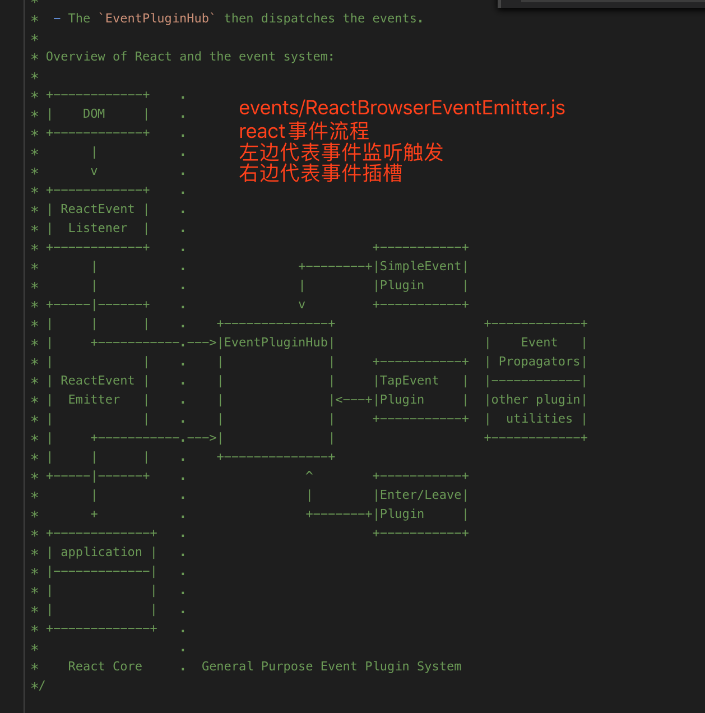
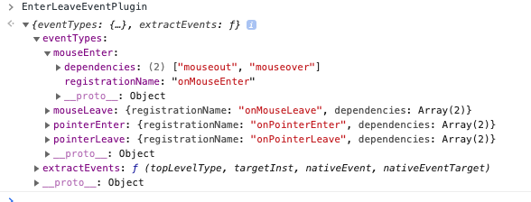

## 基本概括

先放一张react事件系统的图，这个图在源码文件中可以找到，由官方提供



上面这张图分为两个部分：
左边是`react core`部分，是从前面学到的整个流程一直到`completeWork`之后，注入属性的时候注入事件的流程
右边包括`EventPluginHub`是`react`事件系统的关键，`插槽系统`

我们从中间到右边开始看

React在进程初始的时候会执行`injectEventPlugin`

```js
// react-dom/src/client/ReactDOMClientInjection.js

/**
 * Inject modules for resolving DOM hierarchy and plugin ordering.
 */
EventPluginHubInjection.injectEventPluginOrder(DOMEventPluginOrder);
setComponentTree(
  getFiberCurrentPropsFromNode,
  getInstanceFromNode,
  getNodeFromInstance,
);

/**
 * Some important event plugins included by default (without having to require
 * them).
 */
EventPluginHubInjection.injectEventPluginsByName({
  SimpleEventPlugin: SimpleEventPlugin,
  EnterLeaveEventPlugin: EnterLeaveEventPlugin,
  ChangeEventPlugin: ChangeEventPlugin,
  SelectEventPlugin: SelectEventPlugin,
  BeforeInputEventPlugin: BeforeInputEventPlugin,
});
```

`injectEventPluginOrder`和`injectEventPluginsByName`两个注入方法，是来自`/events/EventPluginRegistry.js`中的两个方法。在初始化的时候`injectEventPluginOrder`没什么作用，我们就先只关注`injectEventPluginsByName`。所以这里不得不先提一下里面的5个参数

* SimpleEventPlugin
* EnterLeaveEventPlugin
* ChangeEventPlugin
* SelectEventPlugin
* BeforeInputEventPlugin

这里拿`SimpleEventPlugin`举个例子

![SimpleEventPlugin]

可以从图中看到，`SimpleEventPlugin`有三个属性，其中`extractEvents`大概是分类给一些事件赋值，当然里面的都是初始化的值。比如说鼠标事件会有一些`pageX clientY`等点击坐标，或者是`target`点击对象等等；而另外一个函数`getEventPriority`是获取事件的权重，是在后期执行的时候方便react知道如何进行`update`分配的。这两个配角属性说完我们看看主角`eventTypes`。这里面包含了许多dom原生的事件名，包括他们的依赖以及权重 -- 也就是`getEventPriority`取的值，已经冒泡捕获时候的阶段



`EnterLeave`事件有另外一个属性`registrationName`，而没有`phasedRegistrationNames`，是因为这类事件不支持冒泡，所以只有一个名字

```js
// eventTypes 类型的结构
export type DispatchConfig = {
  dependencies: Array<TopLevelType>,
  phasedRegistrationNames?: {   
    bubbled: string,   // 单独的冒泡名 onClick
    captured: string,     // 单独的捕获名  onClickCapture
  },
  registrationName?: string,      // 不支持冒泡的事件名   onMouseEnter
  eventPriority: EventPriority,    // 事件权重，SimpleEventPlugin中有，配合getEventPriority使用
};

```


介绍完参数我们回到正题，也就是`injectEventPluginsByName`把五个对象注入进`EventPluginHub`。这里的作用其实是把刚才调用传入的对象参数，写到`namesToPlugins`这个*模块变量*里，注意`pluginModule`是引用赋值。同时，只要有新增或修改的，就需要调用`recomputePluginOrdering`

`recomputePluginOrdering`主要是调整一个控制事件插件可注入的顺序的数组变量`eventPluginOrder`。然后根据修改的下标注入的`plugins`的数组里去，最后调用了`publishEventForPlugin`

`publishEventForPlugin`只是一个引出另外一个`publishRegistrationName`函数，只是在有冒泡和捕获双阶段的事件的时候会分开调用。也就是说，会多传一个我们在业务中常用的属性名`onClick`,`onMouseEnter`这样

而`publishRegistrationName`更简单，就是按照`key-value`的形式，把事件注入到`registrationNameModules`,`registrationNameDependencies`中，这两个变量在后续触发的时候也会用到，前者的value就是`EventPlugin`的内容，后者的value就是对应到原生事件中的依赖，是`type DispatchConfig`中的`dependencies`

至此我们的`EventPluginHub`就解决完毕，其实就是一个用键值对存储事件的变量`registrationNameModules`。后续在事件监听和事件触发的时候我们会用到这个事件插槽，所以这章先了解一下这个概念

```js
/**
 * Injects plugins to be used by `EventPluginHub`. The plugin names must be
 * in the ordering injected by `injectEventPluginOrder`.
 *
 * Plugins can be injected as part of page initialization or on-the-fly.
 *
 * @param {object} injectedNamesToPlugins Map from names to plugin modules.
 * @internal
 * @see {EventPluginHub.injection.injectEventPluginsByName}
 */
export function injectEventPluginsByName(
  injectedNamesToPlugins: NamesToPlugins,
): void {
  let isOrderingDirty = false;
  for (const pluginName in injectedNamesToPlugins) {
    // 排除原型链中的属性
    if (!injectedNamesToPlugins.hasOwnProperty(pluginName)) {
      continue;
    }
    const pluginModule = injectedNamesToPlugins[pluginName];
    if (
      !namesToPlugins.hasOwnProperty(pluginName) ||
      namesToPlugins[pluginName] !== pluginModule
    ) {
      namesToPlugins[pluginName] = pluginModule;
      isOrderingDirty = true;
    }
  }
  if (isOrderingDirty) {
    recomputePluginOrdering();
  }
}


/**
 * Recomputes the plugin list using the injected plugins and plugin ordering.
 *
 * @private
 */
function recomputePluginOrdering(): void {
  if (!eventPluginOrder) {
    // Wait until an `eventPluginOrder` is injected.
    return;
  }
  for (const pluginName in namesToPlugins) {
    const pluginModule = namesToPlugins[pluginName];
    const pluginIndex = eventPluginOrder.indexOf(pluginName);
    if (plugins[pluginIndex]) {
      continue;
    }
    plugins[pluginIndex] = pluginModule;
    const publishedEvents = pluginModule.eventTypes;
    for (const eventName in publishedEvents) {
      publishEventForPlugin(
        publishedEvents[eventName],
        pluginModule,
        eventName,
      )
    }
  }
}


/**
 * Publishes an event so that it can be dispatched by the supplied plugin.
 *
 * @param {object} dispatchConfig Dispatch configuration for the event.
 * @param {object} PluginModule Plugin publishing the event.
 * @return {boolean} True if the event was successfully published.
 * @private
 */
function publishEventForPlugin(
  dispatchConfig: DispatchConfig,
  pluginModule: PluginModule<AnyNativeEvent>,
  eventName: string,
): boolean {
  eventNameDispatchConfigs[eventName] = dispatchConfig;
  // 支持冒泡的事件类型
  const phasedRegistrationNames = dispatchConfig.phasedRegistrationNames;
  if (phasedRegistrationNames) {
    for (const phaseName in phasedRegistrationNames) {
      if (phasedRegistrationNames.hasOwnProperty(phaseName)) {
        const phasedRegistrationName = phasedRegistrationNames[phaseName];
        publishRegistrationName(
          phasedRegistrationName,
          pluginModule,
          eventName,
        );
      }
    }
    return true;
  // 不支持冒泡的事件类型
  } else if (dispatchConfig.registrationName) {
    publishRegistrationName(
      dispatchConfig.registrationName,
      pluginModule,
      eventName,
    );
    return true;
  }
  return false;
}


/**
 * Publishes a registration name that is used to identify dispatched events.
 *
 * @param {string} registrationName Registration name to add.
 * @param {object} PluginModule Plugin publishing the event.
 * @private
 */
function publishRegistrationName(
  registrationName: string,
  pluginModule: PluginModule<AnyNativeEvent>,
  eventName: string,
): void {
  registrationNameModules[registrationName] = pluginModule;
  registrationNameDependencies[registrationName] =
    pluginModule.eventTypes[eventName].dependencies;
}

```